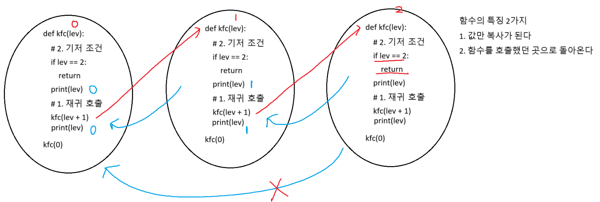
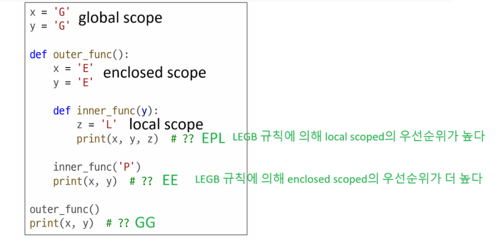

# 07.23.(수)
# input()
* 파이썬 가동후 입력해야 값이 넣어짐. 
예문)
1. 문자열 입력받기
char = input()

2. 정수 입력받기
num = int(input())

3. 정수 2개 입력받아서 각각의 변수에 할당
map함수, split()메서드
map함수를 쓰는 목적 : 정수로 변환 

예문)
a, b = map(int, input().split())
print(a, b)

4. 정수 여러개를 입력받아서 리스트에 할당
# 이해못함. 
arr = list(map(int, input().split()))
print(*arr)

result = []
for _ in range(3): # 3행
    arr = list(map(int, input().split()))
    result.append(arr) # 행 추가, 행 추가, 행 추가

print(result)

arr = [list(map(int, input().split())) for _ in range(3)]
print(arr)

# 함수, 연습마니
예문) 
def add_num(a, b): #정의
    result = a + b
    return result 
a = 2
b = 3
sum_result = add_num(a, b) #호출
print(sum_result)

# parameter(매개변수) vs argument(인자)
상부, add_num(a, b) 중 a, b 가 parameter.
이어서, sum_result = add_num(a, b) 중 a, b가 argument 

# 재귀 함수란?
이 함수가 재귀함수다! 어떻게 알수 있을까?
1. 재귀 호출(자기 자신을 호출)이 있으면 재귀 함수
    1. 단 주의 : 무한 loop에 빠질 수 있다.
    2. 무한 loop를 막으려면?
2. 기저 조건(종료 조건) >>>>> return

예문) 
def kfc(lev):
    # 2. 기저 조건
    if lev == 2:
        return
    print(lev)
    # 1. 재귀 호출 2번
    kfc(lev + 1)
    kfc(lev + 1)
    print(lev)

kfc(0)

# sort()와 sorted()의 차이??
1. 공통점 : 정렬(오름차순)
arr = [1, 2, 3, 4, 5]
2. 차이점
   1. 반환 X, 원본 변경 ---> sort()
arr.sort()
   2. 반환 O, 원본 변경 X ---> sorted()
sorted_arr = sorted(arr, reverse=True) # 내림 차순

# 전역변수 vs 지역변수
- 중요

#### global은 왜쓸까?
* 초기화 반복을 막으려고 

a = 30 # global scope # 10으로 수정

def kfc():
    global a # global 쓰는 목적? # 전역변수를 수정 하고 싶을 때
    a = 10 # local scope
    b = 20 # local scope
    print(a) # 10

kfc()
print(a) # 10 # built-in scope

# map 함수란?
예문)
a, b = map(int, input().split())
예문) 
map(첫번째 인자==함수, 두번째 인자==iterable)

# iterable이란??
# 이해못함! 
arr = [1, 2, 3, 4]

char = "hello"

my_tuple = (1, 2, 3)

my_dict = {"apple": 1, "banana": 2, "grape": 3}

my_set = {1, 2, 3}

- 시퀀스(순서가 있는, 인덱스가 있는) == iterator (X)
- iterable : 반복 가능한 객체
# 이해못함

for i in arr: # iterator 방식으로 순회했다.
    print(i, end = ' ')

for i in char:
    print(i, end = ' ')

for i in my_tuple:
    print(i, end = ' ')

for i in my_dict: # key를 기준으로 순회
    print(i, end = ' ')

for i in my_set: # hash값이 작은 순서대로 순회
    print(i, end = ' ')

# 0723 복습
(자주틀리는 부분만 적음)

===
# 함수를 수정하고 호출 결과를 result_1 변수에 할당하여 출력하시오.
def is_negative(a):
    if a <= 0:
        return  True # (오답)return = True
    else:
        return False # (오답)return = False
print( is_negative(3) ) 

# is_negative(3) 결과 : False
# 함수를 수정하고 호출 결과를 result_2 변수에 할당하여 출력하시오.
def default_arg_func(default='기본 값'):
    return default

result_3 = default_arg_func()
result_4 = default_arg_func('다른 값')
print(result_3)
print(result_4)

number_of_people = 0

def increase_user(): #짜장
    global number_of_people # 0 (오답)globals.number_of_people
    number_of_people += 1 #1

increase_user() # 호출, (오답)increase_user(0) #이건 왜 있는 걸까? 
print(f'현재 가입 된 유저 수 : {number_of_people}')
===