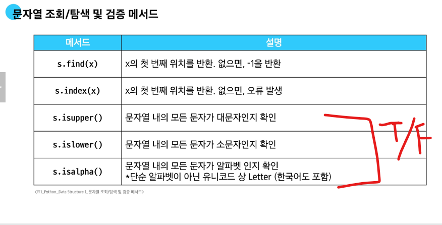
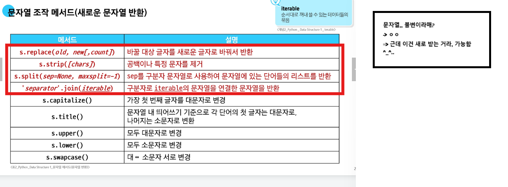
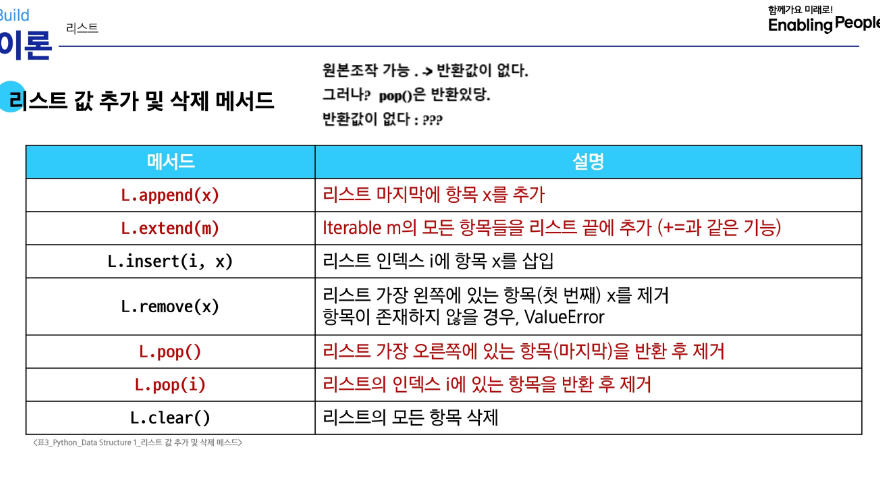
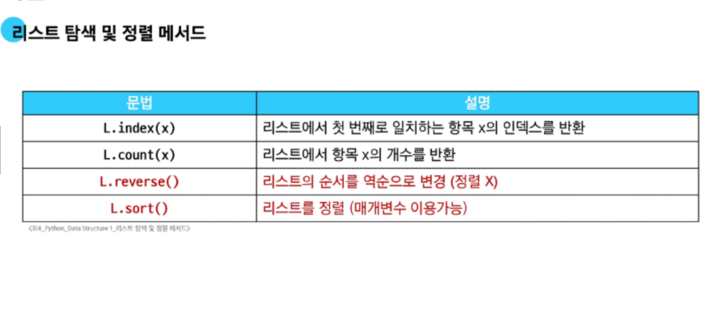
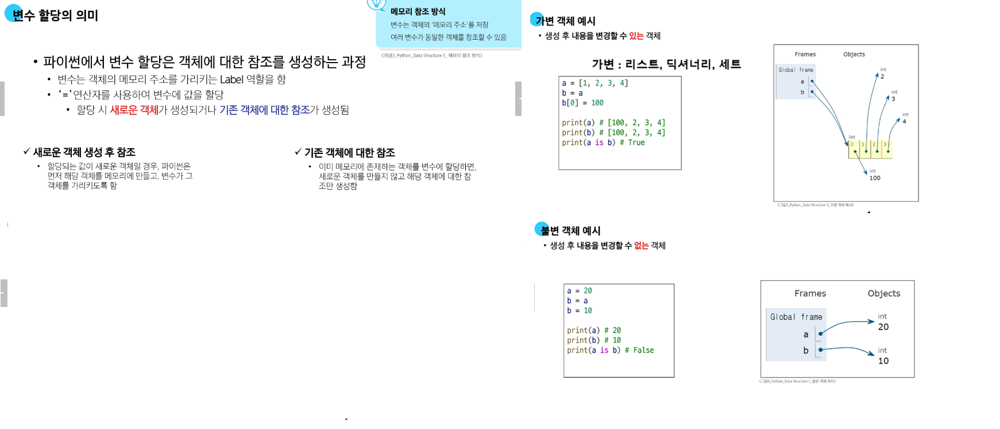

# find 

    1.  str.find() : str 내 특정 문자 찾아 
    2.  str.find('a', n) : n번째 인덱스부터 시작해 'a'문자를 찾아 
        1. 문자 내 값을 빼고자. 

# 메서드    
- 함수 사용법이 다름
- 각 타입마다 메서드 다름
1. 사용법
리스트.append()
객체.메서드()
2. 타입별 메서드 다름 
    1. 문자열 메서드 예시
    print('hello'.capitalize())  # Hello
    2. 리스트 메서드 예시
    numbers = [1, 2, 3]
    numbers.append(4)
    print(numbers)  # [1, 2, 3, 4]

# 문자열 조작 메서드
#  .replace(old, new, 갯수)
    1.  예문
    Text = 'Hello, world! world world'
    new_text1 = text
    new_text2 = text
    print(new_text1.replace('world!', 'Python', 1))  # Hello, Python! Python Python
    print(new_text2)  # Hello, Python! world world
# .strip(문자)
# split
    text = 'Hello, world lalalala!'
    words1 = text
    words2 = text
    print(words1.split())  # ['Hello,', 'world', 'lalalala!']
    print(words2.split('l'))  # ['He', '', 'o, wor', 'd ', 'a', 'a', 'a', 'a!']
# join
    words = ['Hello', 'world!']
    new_text = '-'.join(words) 
    print(new_text)  # Hello-world!

# 리스트 메서드 (중요)
# append
    my_list = [1, 2, 3]
    my_list.append(4)
    print(my_list)  # [1, 2, 3, 4]
# **append는 None을 반환합니다. (== 반환값이 없다. )**
    print(my_list.append(5))  # None
    
# extend
my_list = [1, 2, 3]
my_list.extend([4, 5, 6])
print(my_list)  # [1, 2, 3, 4, 5, 6]

# extend와 append의 비교
my_list.append([5, 6, 7])
print(my_list)  # [1, 2, 3, 4, 5, 6, [5, 6, 7]]
# element 한개 추가 -> append, 
# iterable 추가 -> extend 

# 이해못함! 
# my_list.extend(100)  # TypeError: 'int' object is not iterable

# insert
- 원하는 곳에 값을 넣을 때 사용. 
my_list = [1, 2, 3]
my_list.insert(1, 5)
print(my_list)  # [1, 5, 2, 3]

# remove 
my_list = [1, 2, 3, 2, 2, 2] #첫 번쨰로 일치하는 항목을 삭제. 
my_list.remove(2)
print(my_list)  # [1, 3, 2, 2, 2]

# pop 아주중요
my_list = [1, 2, 3, 4, 5] #지정 인덱스 제거후 반환. 
item1 = my_list.pop()
item2 = my_list.pop(0) # 맨 끝 element 제거, 반환

print(item1)  # 5
print(item2)  # 1
print(my_list)  # [2, 3, 4]

# clear
my_list = [1, 2, 3] #요소를 제거
my_list.clear() 
print(my_list)  # []

# 리스트 탐색 및 정렬 메서드

# index
my_list = [1, 2, 3]
index = my_list[0]
print(index)  # 1

# count
my_list = [1, 2, 2, 3, 3, 3]
counting_number = my_list[3]        
print(counting_number)  # 3

# reverse
my_list = [1, 3, 2, 8, 1, 9]
my_list.reverse()  
# **reverse는 None을 반환합니다.**
# print(my_list.reverse())  # None
# reverse는 원본 리스트를 변경합니다. 
print(my_list)  # [9, 1, 8, 2, 3, 1] #리스트의 순서를 역순으로 변경함**(정렬X)**

# sort 
# 아주중요, 리스트의 순서를 **정렬**하는 메서드! 
my_list = [3, 2, 100, 1]
my_list.sort() #인자로, reverse=False 가 기본값.

# **sort는 None을 반환합니다.**
# print(my_list.sort())  # None #이거 왜이럼? 원본 반환해서 그렇대.. (이해못함!)
# sort는 원본 리스트를 변경합니다.
print(my_list)  # [1, 2, 3, 100]

# sort(내림차순 정렬)
my_list.sort(reverse=True)
print(my_list)  # [100, 3, 2, 1]

# 얕은 복사
# 방법: 슬라이싱, copy 메서드, list() 함수 3가지방법~ 
# 서로 다른 메모리 주소를 가짐

# 1차원 리스트에서의 얕은 복사 (리스트 슬라이싱)
a = [1, 2, 3]
b = a[:] # 슬라이싱 -> 할당 -> 다른 메모리 주소를 가짐. 즉 b바꿔도 a영향 안줌~ 

print(a)  # [1, 2, 3]
print(b)  # [1, 2, 3]

# 1차원 리스트에서의 얕은 복사 (copy 메서드)
a = [1, 2, 3]
b = a.copy() 

print(a)  # [1, 2, 3]
print(b)  # [1, 2, 3]

# 1차원 리스트에서의 얕은 복사 (list() 함수)
a = [1, 2, 3]
d = list(a)
a[0] = 100

print(a)  # [100, 2, 3]
print(d)  # [1, 2, 3]

# 얕은 복사의 한계: 최상위 리스트만 복사됨. -> 깊은복사의 필요성! 

print('\n다차원 리스트 얕은 복사의 한계')
a = [1, 2, [3, 4, 5]]
b = a[:]

b[0] = 999 

print(a)  # [1, 2, [3, 4, 5]]
print(b)  # [999, 2, [3, 4, 5]] #여기선 다르다가? 

b[2][1] = 100 
print(a)  # [1, 2, [3, 100, 5]]
print(b)  # [999, 2, [3, 100, 5]] #다시 합쳐짐.. 

print(f'a[2]와 b[2]가 같은 객체인가? {a[2] is b[2]}')  # True

# 깊은 복사
# 내장 모듈 끌고와야함. import copy ! 

import copy 
print('깊은 복사 예시')
a = [1, 2, [3, 4, 5]]
b = copy.deepcopy(a)

b[2][1] = 100

print(a)  # [1, 2, [3, 4, 5]]
print(b)  # [1, 2, [3, 100, 5]]
print(f'a[2]와 b[2]가 같은 객체인가? {a[2] is b[2]}')  # False

# 복잡한 중첩 객체 예시 (딕셔너리)
print('복잡한 중첩 객체 깊은 복사')
original = {
    'a': [1, 2, 3],
    'b': {'c': 4, 'd': [5, 6]},
}
import copy
copied = copy.deepcopy(original)

copied['a'][1] = 100
copied['b']['d'][0] = 500

print(f'원본: {original}')  # {'a': [1, 2, 3], 'b': {'c': 4, 'd': [5, 6]}}
print(f'복사본: {copied}')  # {'a': [1, 100, 3], 'b': {'c': 4, 'd': [500, 6]}}
print(
    f"original['b']와 copied['b']가 같은 객체인가? {original['b'] is copied['b']}"
)  # False

# list-comprehension 
# 사용 전
numbers = [1, 2, 3, 4, 5]
squared_numbers = []

for num in numbers:
    squared_numbers.append(num**2)

print(squared_numbers)

# 사용 후
numbers = [1, 2, 3, 4, 5]
squared_numbers = [num**2 for num in numbers]
# squared_numbers = list(num**2 for num in numbers)
print(squared_numbers) #[1, 4, 9, 16, 25]

# List Comprehension 활용 예시
# "2차원 배열 생성 시 (인접행렬 생성 시)"

deta1 = [[0] * 5 for _ in range(5)]
deta2 = [[0 for _ in range(5)] for _ in range(5)]
print(deta1)  #[[0, 0, 0, 0, 0], [0, 0, 0, 0, 0], [0, 0, 0, 0, 0], [0, 0, 0, 0, 0], [0, 0, 0, 0, 0]]
print(deta2) # [[0, 0, 0, 0, 0], [0, 0, 0, 0, 0], [0, 0, 0, 0, 0], [0, 0, 0, 0, 0], [0, 0, 0, 0, 0]]

"""
[[0, 0, 0, 0, 0],
 [0, 0, 0, 0, 0],
 [0, 0, 0, 0, 0],
 [0, 0, 0, 0, 0],
 [0, 0, 0, 0, 0]]
"""
# 리스트를 생성하는 방법 비교: 성능유사. 가독성에 따라서 사용
# 1. for loop
result1 = []
for i in range(10):
    result1.append(i)

# 2. list comprehension
result2 = [i for i in range(10)]
# result2 = list(i for i in range(10))

# 3. map
result3 = list(map(lambda i: i, range(10)))

print(result1)
print(result2)
print(result3)

# 리스트 메서드 체이닝

# 잘못된 체이닝 방식 1
numbers = [3, 1, 4, 1, 5, 9, 2]
result = numbers.copy().sort()
print(numbers)  # [3, 1, 4, 1, 5, 9, 2] (원본은 변경되지 않음)
print(result)  # None (sort() 메서드는 None을 반환하기 때문) 이해못함! 
# 개선된 방식
# 필요한 경우 새로운 리스트 객체를 반환하는 함수를 사용하는 것이 좋음
# sort vs sorted 반환값 여부, 원본 변경 ㄴㄴ => sorted 
sorted_numbers = sorted(numbers.copy())
print(sorted_numbers)  # [1, 1, 2, 3, 4, 5, 9]

# 잘못된 체이닝 방식 2
# result = numbers.append(7).extend([8, 9])  # AttributeError
result = numbers.append(7)  # None 반환해성.
print(result) # None

======
# map 함수 : map(조건,interable)
# def할때 pass 사용
# enumerate 함수 : 
- 인덱스 알고 싶을 때 사용해용.. 

