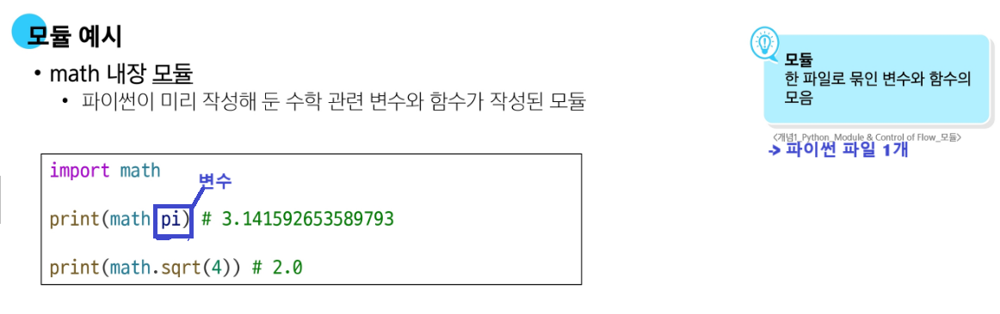
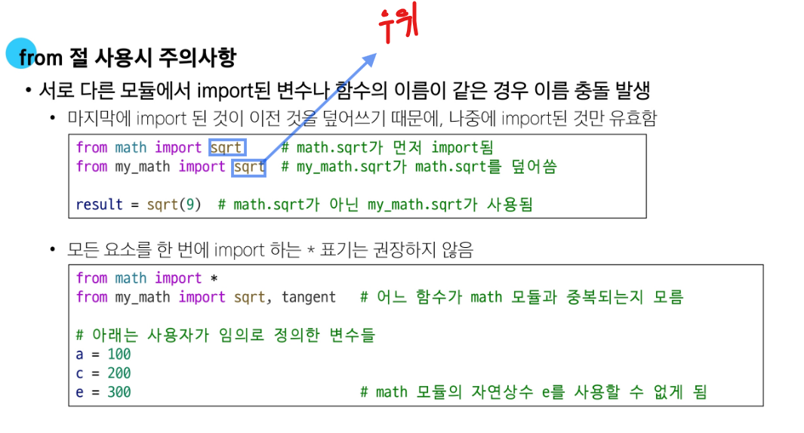
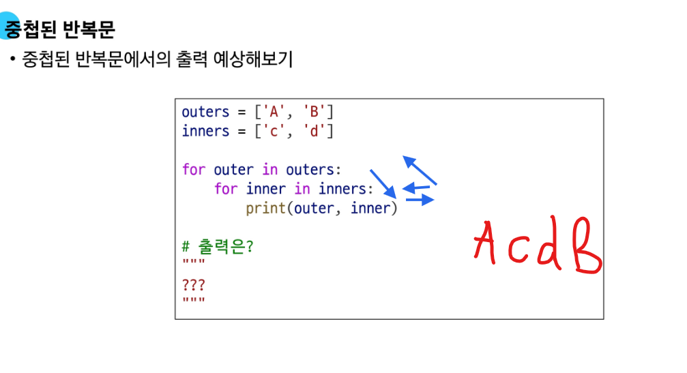
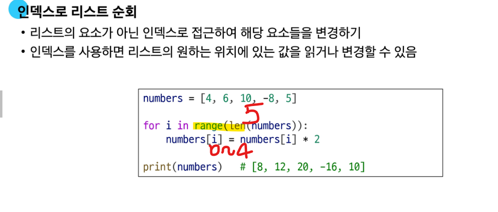
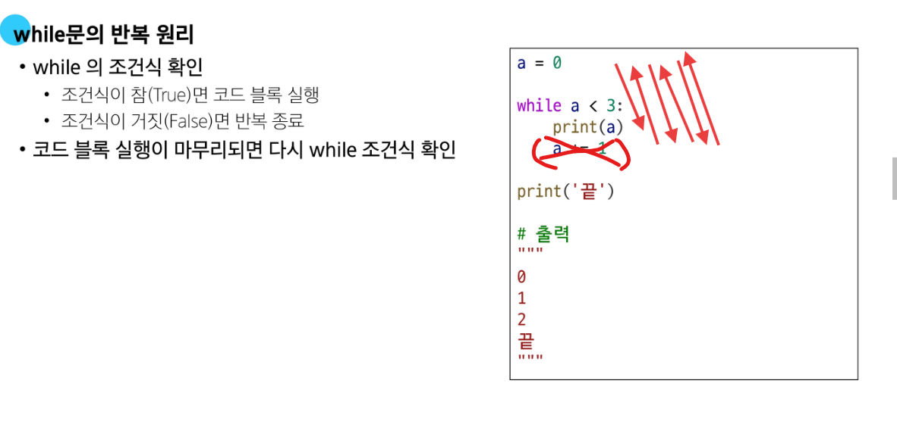

# 내장모듈1

# import 문 사용

# 내장모듈2 - from문 이용

- 01-basic.py 참조~ 
# from 절 사용

# PSL (파이썬 표준 라이브러리)
- 제공되는 모듈과 패키쥐
- 패키쥐? 모듈을 모아~, 모듈함 

# 내장모듈 아니면? 

# pip , 웹에서 오픈된 거 받아씀여~ 
- (주의) import  아니라 pip 명령어를 쓴대~ 04-requests- 파일 참조 

# 조건문
- 이건 맞고 저건 틀리다? 
예뮨)
<마쟈>
if 조건1:
    code...
elif 조건2:
    code... 

<틀려>
if 조건1:
    code...
if 조건2:
    code... 
* 왜냐면,,, elif능 if 조건이 아닐 때 쓰는 겅뎅.. 그래서 순차적잉뎅.. 
* 틀려예시능... 

# for/while
- for문 언제 사용할까용,,,,
- 특정 구간 반복시 -> for
- 특정 조건에서 멈출랭 -> while
- ![요약]
예문) for문 

# break, continue
- break : 특정조건 만나면 끗 
- continue : 특정조건 만나면 반복문 처음으로 돌아가기 
- 

=====
# 실습실에서 몰랐던 것들 
*if문. 
year = int
# 값을 비교할 그릇이 필요해. 그래서 year에 할당행.
# year = input() -> 문자로 나와 
# year = int(input()) 

    if int(input(a)) / 4 == 0:  
# input()에는 값이 들어가선 안돼. 내가 터미널에서 값을 넣어줘야 해 
        print(1) #윤년
    if int(input()) / 100 != 0:
        print(1)
    elif int(input()) / 400 == 0:
# 모든 걸 한번에 할 수 있어. 
# 조건: 4로 나누어지고, 100으로 나누어지지 않는다. 그리고 400으로 나누어진다.
#   if year % 4 == 0 and year % 100 != 0 or year % 400 == 0 
# / : 몫, % : 나머지 
        print(1)
    else:
        print(0)
- 답안
year = int(input())
if year % 4 == 0 and year % 100 != 0 or year % 400 == 0:
        print(1)
    else
        print(2)

# 2중 for 문 
- 답안 
for i in range(1, 4): # for i, i를 반복한다. 1~3 #1 2 3 
     for j in range(1, 5):  #1 2 3 4 
         print(i, j) 
# for 문
- 예시
arr = [0] * 5 # arr = [0, 0, 0, 0, 0]

for i in range(5):  # i = 0, 1, 2, 3, 4 줄줄이 생성해내는 포문~ 
    arr[i] =   i + 5 # [5, 6, 7, 8, 9]

print(arr)

# while 문
- 형태
초기식
while 조건식:
    code
    증감식

# 0725 실습
'''도전17
arr = list(map(int, input().split()))

# for i in arr:
#     if i % 2 == 0: 
#         True
print(int(any(i % 2 == 0 for i in arr)))
# print(arr)
# flag 처리 코드를 flag 변수를 쓰지 않고, 함수로 바꿔
# 어떤 함수를 써야할 지 모르겠어.. 힌트 점 

# arr = list(map(int, input().split()))
# print(int(any(i % 2 == 0 for i in arr)))

# any함수: 조건에 맞으면 True 뱉엉, iterabel(반복가능한 것)을 받아야 해
# 만약, any(i % 2 == 0) 이면 "파이썬 : i는 누구야? 혼란스러어.." 
'''
