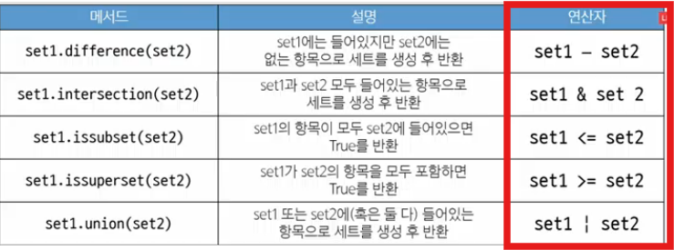

0729
# 

# get
# 값/None 반환 
person = {'name': 'Alice', 'age': 25}
print(person.get('name')) #Alice
print(person.get('gahee','hi')) #hi
print(person.get('gahee')) #None
# print(person['country'])  # KeyError: 'country'
    - (참고) request.get(url) 과는 다른 get.

# keys
# 키 모은 객체 반환 
person = {'name': 'Alice', 'age': 25}
print(person.keys())  # dict_keys(['name', 'age'])

for key in person.keys():
    print(key) #name, age 

# values
# 값 모음 객체 반환 
person = {'name': 'Alice', 'age': 25}
print(person.values())  # dict_values(['Alice', 25])
for value in person.values():
    print(value)

# items 
# 키, 값 쌍 반환 

person = {'name': 'Alice', 'age': 25}
print(person.items())  # dict_items([('name', 'Alice'), ('age', 25)])

for key, value in person.items():
    print(key, value)

# pop
# 키 제거 연결 값 반환 
person = {'name': 'Alice', 'age': 25}
print()  # 25
print()  # {'name': 'Alice'}
print(person.pop('country', None))  # None
# print(person.pop('country'))  # KeyError: 'country'

# clear
person = {'name': 'Alice', 'age': 25}
person.clear()
print(person) #{}
<> 재할당 -> 메모리주소 바뀜. 

# setdefault
# (중요) get과 차이점: 키 없으면 새로 **추가**
# 디폴트, 값 반환 
person = {'name': 'Alice', 'age': 25}
print(person.setdefault('country', 'KOREA'))  
# {'name': 'Alice', 'age': 25, 'country': 'KOREA'}

# update
# 키값 쌍으로 딕셔너리 갱신하고 덮어씀. 
# 키워드 인자로 갱신 가능함. 
person = {'name': 'Alice', 'age': 25}
other_person = {'name': 'Jane', 'country': 'KOREA'}

person.update(other_person)
print(person)  # {'name': 'Jane', 'age': 25, 'country': 'KOREA'}

person.update(age=100, address='SEOUL') #age=100 키=값
print(
    person
)  # {'name': 'Jane', 'age': 100, 'country': 'KOREA', 'address': 'SEOUL'}

# set :(비시퀀스, 순서없어!!!) 고유 + 비정렬, 집합연산에 쓰임 

# add
my_set = {'a', 'b', 'c', 1, 2, 3}
my_set.add('d')
print(my_set) # 실행마다 정렬바뀜 

my_set.add('d')
print(my_set)

# update: 
my_set = {'a', 'b', 'c', 1, 2, 3}
my_set.update([1, 4, 5]) # interable 받음
print(my_set)  # 할 때마다 바뀜 

# clear
my_set = {'a', 'b', 'c', 1, 2, 3}
my_set.clear()
print(my_set)  # set() #딕셔너리 없어졍

# remove: 값 없을 때 에러
# discard와 차이점: 에러뜸. 
my_set = {'a', 'b', 'c', 1, 2, 3}
my_set.remove(2)
print(my_set)
my_set.remove(10)  # KeyError: 10

# pop 
# **(중요)임의의 요소를 제거: "무작위"는 아님. "규칙"도 아님 ^_^..** 
# 해시테이블과 pop! 
seen = {1, 6, 3, 5, 'B', 9, 999, -10, -3, 'A'}

a = seen.pop()
print(a)
a = seen.pop()
print(a)
a = seen.pop()
print(a)
a = seen.pop()
print(a)
a = seen.pop()
print(a)
a = seen.pop()
print(a)
a = seen.pop()
print(a)
a = seen.pop()
print(a)

# Q) 이 소스코드를 실행할 때마다 결과가 다를까? 같을까?
# A) 정수의 해시값은 일정하기 때문에 결과가 같다

# Q) pop을 했을때 작은값 먼저 제거하고 반환 ???
# A) X, 문자열이 먼저 나올 때도 있움 

# Q) 세트의 요소에 문자가 있을 때도 실행할 때마다 결과가 같을까? 다를까?

# A) 정수의 해시값은 일정하고, 문자의 해시값은 일정하지 않다.

my_set = {'a', 'b', 'c', 1, 2, 3}
element = my_set.pop() # 1이 많이 나왕 a, b, c도 가끔 
print(element) 
print(my_set)

# discard :remove + 에러 안뜸 
my_set = {'a', 'b', 'c', 1, 2, 3}
my_set.discard(2)
print(my_set)
my_set.discard(10)

# 세트 집합 메서드

set1 = {0, 1, 2, 3, 4}
set2 = {1, 3, 5, 7, 9}
set3 = {0, 1}

print(set1.difference(set2))  # {0, 2, 4}
print(set1.intersection(set2))  # {1, 3}
print(set1.issubset(set2))  # False
print(set3.issubset(set1))  # True
print(set1.issuperset(set2))  # False
print(set1.union(set2))  # {0, 1, 2, 3, 4, 5, 7, 9}

