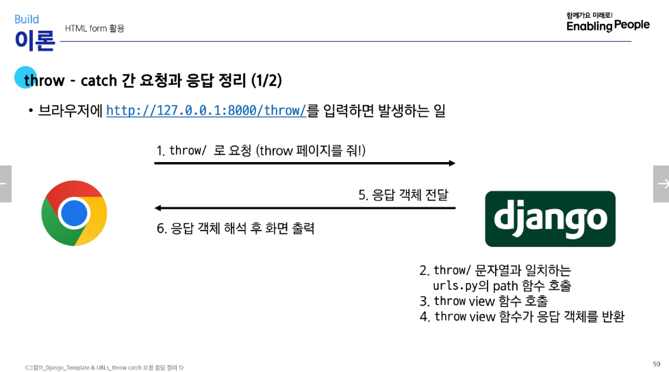
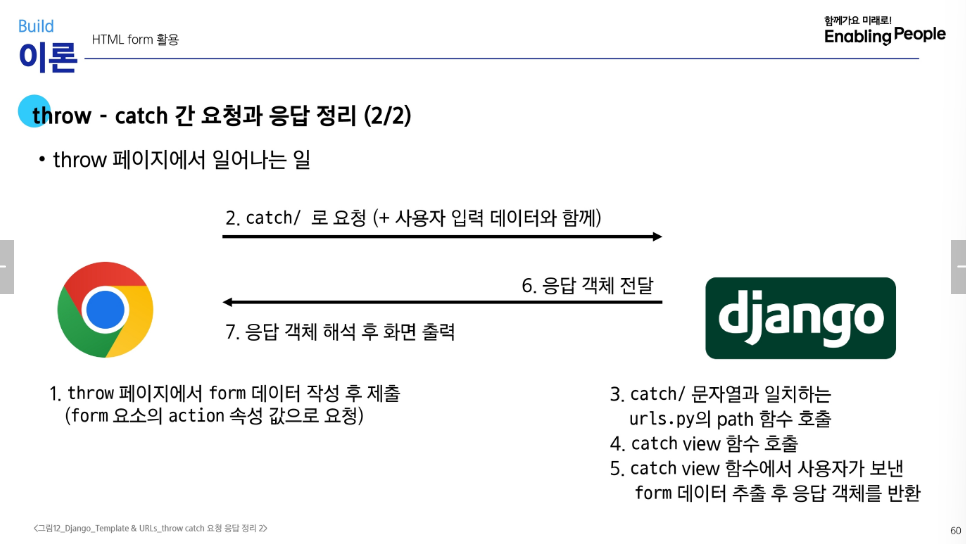
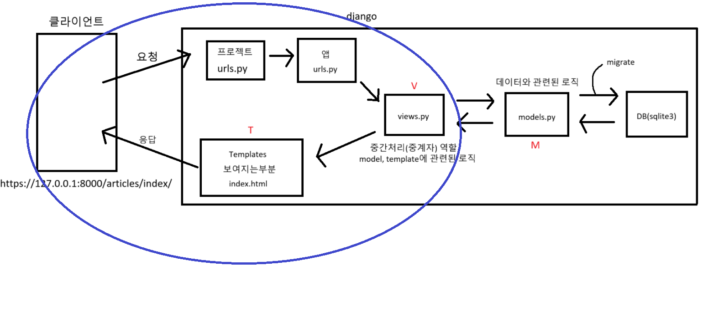

# DTL (Django Template Language)

1. 문법
   - (1) Variable: Template에서 변수, 딕셔너리{}, dot.으로 변수속성 접근 가능
   - (2) Filters: 변수+'?'+필터

# throw-catch 요청과 응답

시작.
python -m venv venv
source venv/Scripts/activate
pip install django / pip install -r requirements.txt
django-admin startproject first_pjt .
python manage.py startapp articles
