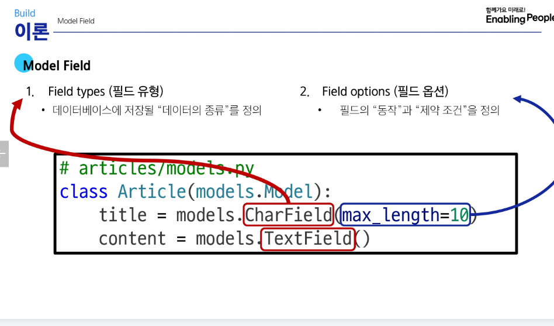
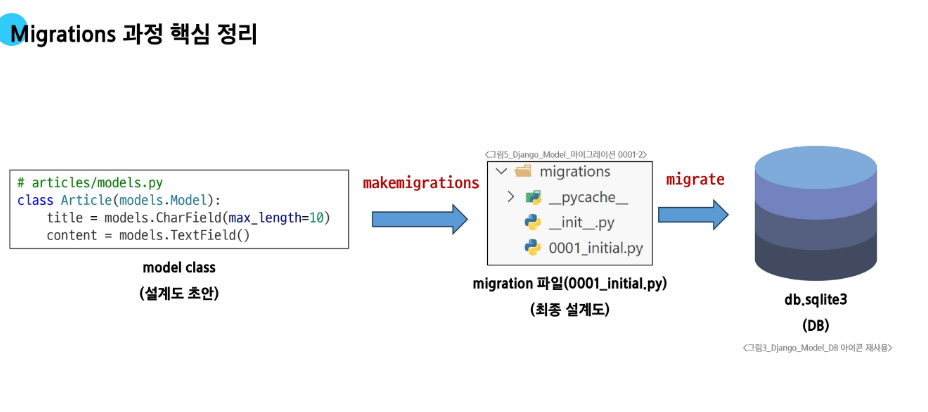
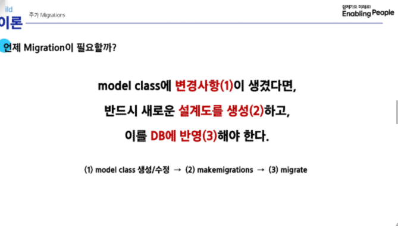

# Model

    1. 데이터베이스와 Python 클래스(객체)로 추상화된 형태로 상호작용
    2. 데이터베이스와 상호작용
    3. 주요 필드 옵션: null, blank. 기본값=False
    4. 장고 공식문서 확인하면서 필드옵션 확인
    5.

## (빈출) 유효성 검사

    1. 정해진 규칙이나 조건에 따라 데이터의 정확성을 확인하는 과정
    2. 컬럼 데이터의 명확성을 위해 제약조건 등 명시적으로 설정 권장

# Migerations

    1. 모델 정의
    2. 마이그레이션 파일(최종 설계도) 생성
        (1) python manage.py makemigrations
        (2) 0001_initial.py 생성
        (3) python manage.py migrate
            가. 모델 변경사항을 기록한 py 코드(최종설계도)를 db로 보낸다.
            나.
    3. 마이그레이션 자동 생성 파일은 직접 수정하거나 삭제하지 않는 것이 원칙

# (빈출) auto_now vs auto_now_add : 저장될 때마다 갱신 / 처음 저장될 때만

# 정리하자면...

# 관리자 인터페이스(Automatic admin interface)

    1. 추가 설정 없이 자동 생성되는 웹 기반 관리 도구
    2. CRUD(생성, 읽기, 업데이트, 삭제) 기능 보유
    3. 관리자 생성
        (1) python manage.py createsuperuser
        (2) DB에 계정 자동 저장
