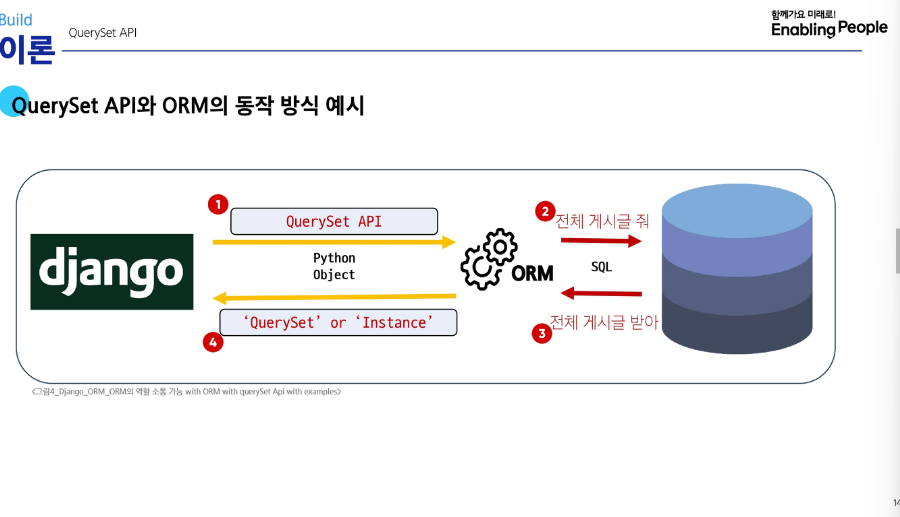

# ORM (Object-Relational-Mapping)

    1. 객체-지향-연결
    2. Django(Python) 과 DB(SQL) 간의 통역사.

# OuerySet API

    1. SQL 번역기 (SQL -> Python으로)
    2. 기본 구조:
        가. Article.objects.all()
    3. 실습:
        가. pip install ipython
        나. pip freeze > requirements.txt
        다. python manage.py shell
        라. In-Article.objects.all()
          Out- <QuerySet []>
        마. exit
        바. python manage.py shell -v 2
            objects imported automatically:
            from articles.models import Article
            Shell에서 생성한 모델을 쓴다.

# Query

    1. 데이터베이스에 특정 데이터를 요청
    2. "쿼리문을 작성한다."
        ; 원하는 '데이터'를 얻기 위해 DB에 요청 '코드'를 작성한다.

# QuerySet

    1. DB에서 전달받은 객체 목록(데이터 모음)

# (중요) create() 메서드는 save()를 내장하고 있어, 자동으로 저장된다.

# CRUD: 생성, 조회, 수정, 삭제 기능

    1. Create:
        [데이터 객체를 만드는 3가지 방법]
        가. 빈 객체 생성후 값 할당 및 저장
          article = Article()
          <Article: Article object (None)>
          article.title = 'first' / title 인스턴스 생성, 모델내 변수명과 동일
          article.save() / DB에 전달
          article = Article()
          <Article: Article object (1)>
          -. id -> pk
          -. pk : Primary Key
        나. 초기 값과 함께 객체 생성 및 저장
          article = Article(title = 'second', content = 'django!')
          article.save()
          !? 마지막 데이터만 불러오네?
        다. create() 메서드로 한 번에 생성 및 저장
          Article.objects.create(title = 'third', content = 'django!')
          <Article: Article object (3)>
    2. Read:
        가. filter ; 다중데이터 출력
          content가 'django!' 출력
          Article.objects.filter(content = 'django!')

        나. get ; 단일데이터 출력
          pk와 같이 고유성 보장된 조회에서 사용
          Article.objects.get(pk=1)
          <Article: Article object (1)>
    3. Update:
        가. 선 조회-후 갱신
          article = Article.objects.get(pk=1)
          article.title = 'byebye'
          article.save()
          결과: DB에서 PK=1 게시글 title이 갱신됨.
    4. Delete:
        가. 선 조회-후 삭제
          article = Article.objects.get(pk=1)
          article.delete()
          결과: pk=1의 레코드(행) 삭제

# pk가 delete된 경우, 재활용되지 않는다.

# filter vs get (비교) 특이하다!

1. Article.objects.filter(content = 'd')
2. <QuerySet []>
3. Article.objects.get(content= 'django!')
4. get() returned more than one Article -- it returned 3!

# github에 DB는 gitignore
