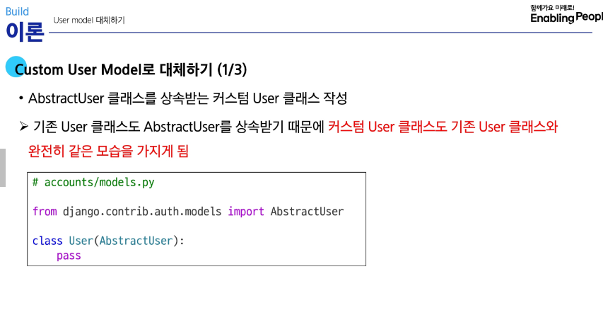
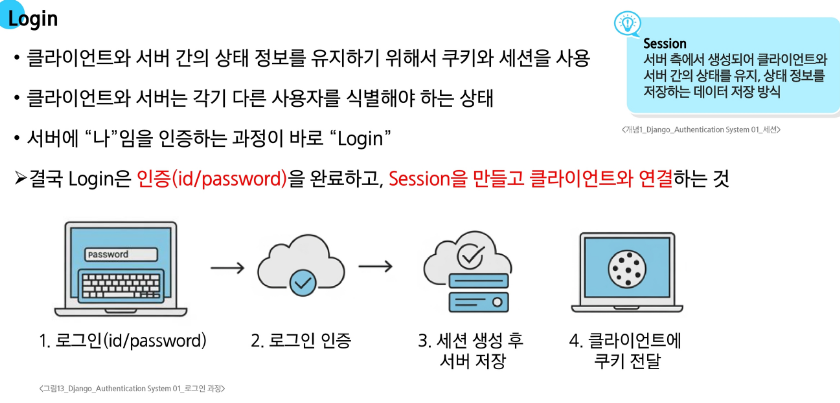
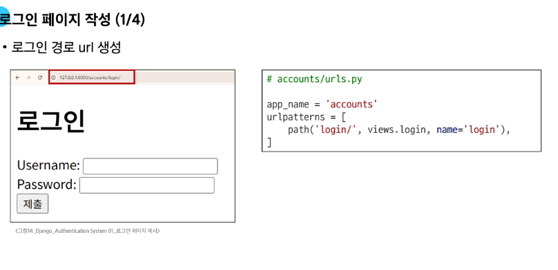

# HTTP

    1. 무상태
        : 연결을 끊는 순간 통신이 끝나며 정보 유지 X
        : 예시, 로그인 상태를 유지할 수 없다.
        -> 왜? 서버 상태를 기억한다면, 저장할 데이터가 쌓이면서 관리가 어려움
        -> 서버의 부담을 줄이기 위해

# 쿠키

- 메인 페이지를 요청했을 때, 장바구니 정보를 저장하는 메커니즘이 뭘까?
- 페이지 줘 -> 쿠키!! -> 장바구니 정보 유지

  1. 웹사이트가 사용자의 브라우저에 남기는 '작은 데이터 조각'이다.
     : 예시, 자동 로그인 유지, 장바구니 상품 저장 등
  2. 저장 방식: KEY-VALUE 형식의 데이터

1. 전송 과정:

   1. 1. HTTP 응답 헤더의 Set-Cookie 필드를 통해 쿠키를 전송,
   2. 2. 브라우저는 쿠키를 저장해 두었다가 동일한 서버에서 재요청하면 저장된 쿠키 함께 전송

2. 주요 용도:

   1. 1. 동일한 브라우저에서 요청한 지 판단
   2. 1. 판단후 로그인 상태를 유지
   3. 3. 무상태 HTTP 프로토콜에서 상태 정보를 기억
   4. 4. 결과: '로그인 된 사용자야!'

3. 사용 목적: 1. 세션 관리 2. 개인화 3. 추적, 수집 : 쿠키 허용/거부 팝업

# 세션

1. 중요 데이터(로그인 정보)를 서버에 저장하고 유지하는 기술
2. 목적: 상태 정보를 유지하고 사용자 식별(쿠키보다 보안에 유리!)
3. 특징: '서버 측에서 생성'되어 상태를 유지
4. 과정:
   1. 서버에서 세션 데이터를 생성 후 저장 -> 세션 ID 생성
   2. ID를 클라이언트로 전달, 클라이언트는 쿠키에 ID 저장
   3. 재요청시 쿠키도 요청과 함께 전송
5. 예시, SWEA에서 자동 로그아웃 : 세션 만료

# 기본 User Model의 한계

1. 내장된 auth 앱에 작성된 User 클래스를 사용
2. 기본 User 모델은 username, password 등 제공 필드가 제한적
3. 개발자가 직접 수정이 어려워 대체

# User Model 대체

# AUTH_USER_MODEL, 프로젝트 중 변경 지양

1.  프로젝트를 시작하며 모델을 대체:
2.  불가피하다면 DB 초기화 후 진행
    1. db.sqlit 삭제 - migrations에 001~n 삭제
3.  (출제) 기본 User 모델과 동일하게 작동(1) 하면서도 나중에 맞춤 설정(2) 가능하다.

# login

