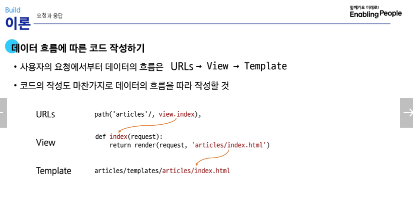
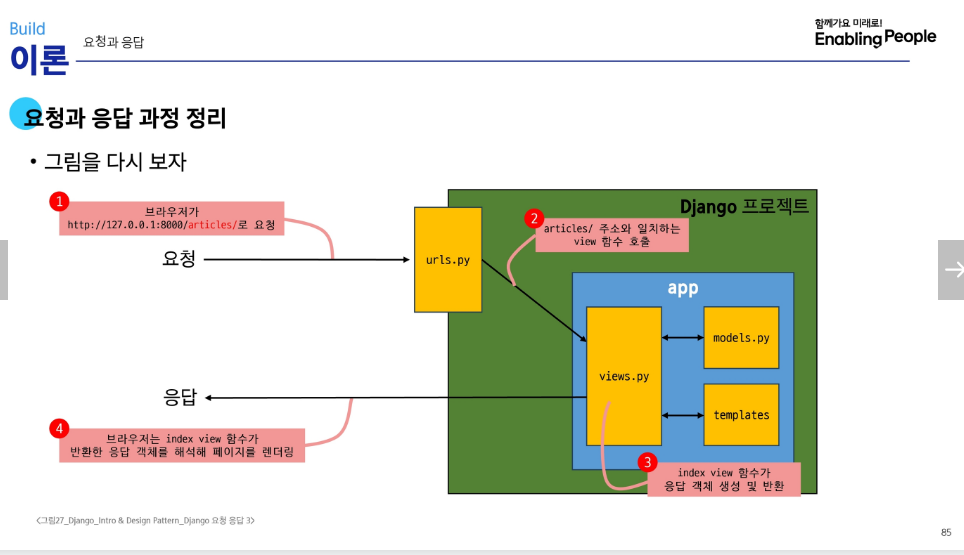

새로운 명령어 정리

# 3step.

1. 가상 환경 생성
   python -m venv venv
   가상환경 만든다 / 파일명
   venv 파일 직접 수정 X

2. 가상 환경 활성화
   활성화 파일명
   source venv/Scripts/activate

- bash에서는 활성화 x - grobal 상태라 영향 x

3. 가상 환경 종료
   deactivate

의존성 패키지

4. 패키지 목록 확인
   pip list

5. 의존성 기록
   pip freeze > requirements.txt

   - 버전을 기록한다. - 컴퓨터 사용시 동일 버전 유지를 위해
   - txt파일이 '의존성 리스트'로 관리한다.

6. 의존성 리스트 사용
   pip install -r requirements.txt
   - 의존성 리스트에 기록된 대로 버전을 설치한다.
   - 의존성 리스트는 django 만들면서 같이 생긴 pip를 의미함.

## 폴더 venv는 .gitignore파일에 작성해 github에 공유하지 않는다.

## venv에는 패키지를 저장함으로, requirements.txt로 공유

1. Django 설치
   pip install django
2. 프로젝트 생성
   django-admin startproject firstpjt .
   .은 경로로 현재폴더
3. 서버 실행
   python manage.py runserver

## 현재까지 정리하자면, 클라이언트의 요청 "(http://127.0.0.1:8000/)"했고

## 서버는 "로켓페이지.이미지"를 응답함.

4. 서버 종료: ctrl + c

# 디자인 패턴

1. MTV 디자인 패턴 : 유지보수 용이
   Model: 데이터 및 비즈니스 로직
   Template: 사용자 사용화면
   View: 사용자의 입력을 받는 Model과 Template

# 프로젝트와 앱

1. 앱 생성
   python manage.py startapp articles
   - 고정 만들기 이름
2. 앱 등록
   - 왜? pj 파일이 앱 파일을 인식하지 못함
   - (반드시) 앱 생성, 후 등록(입력)
   - pj 파일 - settings - INSTALLED_APPS 리스트에 '앱 명' 입력
   - ANGUAGE_CODE = 'ko-kr', TIME_ZONE = 'Asia/Seoul' 변경

# 게시판 만들기-html로 페이지수정

