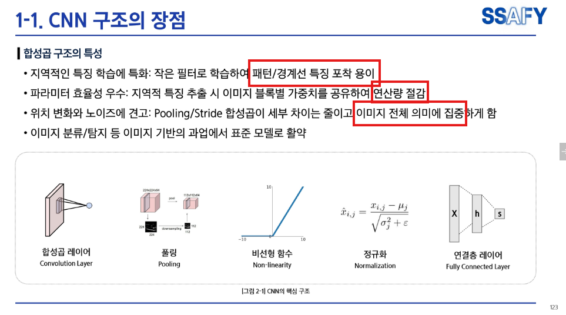
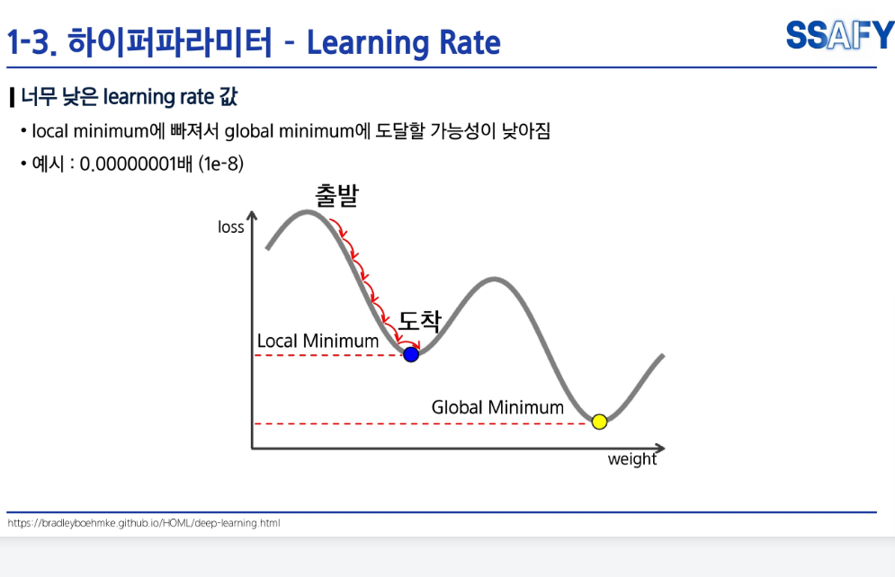

# AI 강의 1차

# AI 강의 2차

1. 단순선형회귀

2. 로지스틱 

3. Shallow network  (앝은 신경망)

- Shallow: 숨은층(히든 레이어)이 1개.
- Deep: 숨은층이 여러 개(보통 3개 이상을 deep이라 부름).

4. Deep network (다 신경망)

- 히든레이어 없이 직접연결? 
- 과적합(오버피팅) 위험↓, 가볍고 해석 가능하며 안정적입니다. 다만 표현력이 낮아 데이터가 복잡할수록 한계가 빨리 와요.

## (결과) 많아질수록, 유연한 곡선이 도출
5. 손실함수

* 이후 드랍   

# AI 강의 3차 - 자연어처리 

1.
## 원-핫 인코딩 

 - 원-핫 인코딩에서 은행과 금융이 독립적인 벡터로 표현되나,
 - 워드 임베딩에서 두 단어의 벡터가 공간상 서로 가깝게 위치하여, 의미적 유사성을 보인다. 

2. 워드 임베딩

  - output과 예측 간의 오차, Loss를 최소화하기 위해 연산한다. 

1. 순차적 데이터 
일반적 모델로 처리 불가 -> 시퀀스 모델 필요
-> 한계: 입력이 가변적이나 출력이 고정됨. 

시퀀스 데이터를 받아 -> RNN LSTM .... 

# RNN VS LSTM(중요) 
 
 
# LSTM, 기울기 소실문제를 해결하기 위해 등장! 
 
- (Cell State) 라는 공간을 만들어서 중요정보 / 비중요 정보를 구분한다.
- (가중치) 중요정보는 cell state에 남겨놓고 나머지는 RNN 방식처럼 처리한다. 
- 정리하자면, RNN은 입력 정보를 거부할 수 없으나, LSTM은 입력 정보를 거부할 수 있다. 이는 Forget gate가 무엇을 버리고 무엇을 유지할 지 결정하기 때문이다.  
- 한계, cell state 라는 병렬방식이 있으나 RNN의 직렬방식 기반이라 여전히 느리다는 평 

 

# 언어 모델
다음 단어를 예측 
 
 

# Seq2Seq 

* encoder -> decoder  -> 문장 생성
* 예시 ; 자연어 처리보다는 코드 등 다양하게 응용됨. 
  * 1. 긴문서 읽고 짧게 요약 보고
  * 2. 입력(질문) -> 출력(대답) ; ai챗봇
* 정답 단어를 디코더 강제입력(Teacher Forcing) -> 안정적 
* Greedy Inference ; 높은 확률이 단어 선택 
* Beam Search ; 매 단계마다 k개의 유망 후보를 선택. 

# Attention 
* 700페이지를 읽은 뒤 덮고 번역한다고 하면, "정교한 번역이 불가능" 
* -> 번역을 하나하나 해야할 것 

* 장점: 
  * 1. 디코더가 필요부분에 집중 가능. 
  * 2. 멀리 떨어진 단어, hidden states 각각에 직접 연결 가능.
* 효과: 강력하다! 
  * 1. 해석 가능성: 장점1에서 어느 부분에 집중했는 지 파악할 수 있다. 따라서 사람이 모델의 참고 근거를 파악할 수 있어, 의사결정 과정을 해석할 수 있다. 
  * 2. 정렬 : 디코더가 필요한 단어에 자동 집중한다. 단어간 매핑 관계를 자연스럽게 학습한다. 

# Self-Attention

# Transformer

# AI 강의 4차
# 딥러닝 및 이미지 모델

# 수용영역: CNN이 이미지를 처리하면서 한 번에 볼 수 있는 영역의 크기 ; 
- 일반적으로, 네트워크가 깊어질 수록 수용영역이 높다.

# [중요] CNN 기반 모델 변천사

# AlexNet 

1. pooling : 다운샘플링 -> 연산/파라미터 수 감소 
2. pad :  너무 빨리 작아지는 걸 방지. 일관된 해상도, 크기 제어  
3. 결과: 연산/메모리 절감하고, 수용영역 확대하여 패턴 관계를 빠르게 묶는다

# VGGNet 

# ResNet 
1. 배경: 단순히 레이어를 깊게 하면 성능 저하 -> 작은 레이어 수준의 성능 보장 
  

# 딥러닝 및 이미지 모델 

# CNN 한계, 
- **데이터의 순서를 무시**  이로인해, 이미지나 문장에서 멀리 떨어진 요소 간의 관계 학습이 어렵다. 
# 순차적 데이터(sequential data) 처리를 위해 RNN 등장! 
- 이전 데이터를 은닉상태(hidden state)로 매핑 -> 다음 단계로 넘긴다. 

# AI 강의 5차 

# 이미지 기반 AI서비스 개발할 때 어디서 시작할까? 

# 이미지 파운데이션 모델 
AI 모델 ; 쉽게 말하면 함수 
  - (특별) 학습 때 보지 못했던 데이터에 대해서도 작동한다! 
  - 이상적인 AI 모델은 검색 엔진과 유사하다.
  - 그러나, 데이터 확보 등 비용이 크다는 한계가 있다. 
  - 현실적인 모델? 데이터를 패턴화하여 압축! 이때, 비슷함과 다름을 파악, 사리분별 시작 
# 현실적 모델 ; 파운데이션 모델 등장! 
- 대규모 데이터 학습 -> 문제에 빠르게 적응 

# 사고 능력과 언어 능력(LLM말야) 만으로 현실 세계를 "이해"하기에 충분할까? 
- 눈을 달자! 귀를 달자!
- 서면 -> GPT -> HTML ;시각언어 멀티모달 언어모델로 능력 
# CLIP ; 눈 
- 언어-이미지 간 유사도 학습 
- (특별) 학습하지 않은, 새로운 도메인의 입력 데이터에 대해서도 좋은 성능을 발휘
    - 처음봐두 알아 ㄷㄷ 
- 인터넷 데이터에서 지도학습
- 이미지-자연어 쌍으로 학습 
- [텍스트 인코더] Transformer 기반 Text encoder -> 토큰 -> Attention 메커니즘, 토큰 간 관계성 ; 이때 입력 토큰은 임베딩의 배열 형태로 입력 
- [이미지 인코더] Vision Transformer 기반 image encoder -> 이미지를 패치로 -> 패치 임베딩, 같은 길이의 벡터로 바꾼다(=토큰 임베딩) -> 위치정보(몇 번째 패치냐?) 더하기 -> Transformer encoder, 패치 처리 , 패치간 관계학습 -> MLP Head를 통해 분류작업 (끝) 

# 주어진 이미지를 분석할 때 물체 탐지 모델로 충분할까? 사용자 요구에 맞출 수 있을까? 그래프나 문서는 이해할까? 대화는 가능할까? 
# SigLIP 
- 배경 : CLIP의 대조학습의 한계를 딛고 나타남. 
- CLIP와 달리 불일치 음성 데이터에 제한된 영향을 받도록 손실함수 디자인을 고침 
- 맞을 수록 강해진다! -> 왜? Sigmoid 함수가 어느 정도 커지면 고려 안하기 때문이다. 
 

# 멀티모달 정합
- 서로 다른 두가지 모달리티 (이미지, 텍스트) 간의 공통 공간, 임베이딩 벡터 공간을 구성 -> 합치기 
  
# LLaVA(Large Language and Vision Assistant)
- 텍스트와 이미지 동시 이해 
- 효율; 적은 자원으로 큰 모델 학습
- 사전학습(선형 레이어를 토큰으로 처리)  
    - 1. 처리 ; 전체 모델을 다시 훈련하지 않아 자원과 시간이 절감 -> 효율 
    - 2. Fine-tuning ; 미세조정, 필요한 부분만 미세조정으로 강화 -> 효율 
  

# 제 도메인에 맞는 모델을 만들려면 어떻게 해야할까요? 부족한 현실 데이터 문제를 극복할 방법은 없을까요? 
# 파운데이션 모델의 주 응용 방법 

- 파운데이션 모델 + Fine-tuning(미세조정) ; 모델 개인화  
- 미세조정 ; 예제가 많을 수록 응답시간이 단축 (토큰 개수 절약 -> 시간단축) 

 
- 높은 learning rate면, loss 최적점에 딱 맞추기 어려움

# 합성데이터 활용법 ; 데이터 효율화를 위해! 
- 지금까지 배운 내용으로, 미세조정/ 전이학습은 사전학습된 모델과 새로 학습할 타겟 모델의 구조가 동일한 경우 
- 다르다면? 지식증류 ; 높은 성능 모델(선생님)을 모방
- 선생님 모델 예측 값과 학생 값이 가까워지도록 유도한다. 
 
 
- 명령 ; 단순 텍스트로 질문 -> 답
- 사람이 작성하는 경우 상대적으로 작은 데이터셋으로 미세조정하나 "미세조정 된 gpt"는 창의적인 지시와 설명을 한다. (사람; 700 vs 후자; 45만 이상)

- 450,000개의 학습용 예제를 생성하고 이를 활용해서 데이터 쌍을 생성 -> 효율 

- 합성 데이터는 취득이 어려운 데이터일수록 더 유용하다.  예를 들어, 심박수 변화, 건물 진동 등 미세한 움직임을 합성 데이터를 통해 학습 가능
- (특별) 합성데이터 × 로봇/제조업”은 안전·비용·데이터 희소성 문제를 한 번에 푸는 카드 -> 안전 시나리오 테스트, 실투입용이(?), 희귀 이벤트 생성 가능