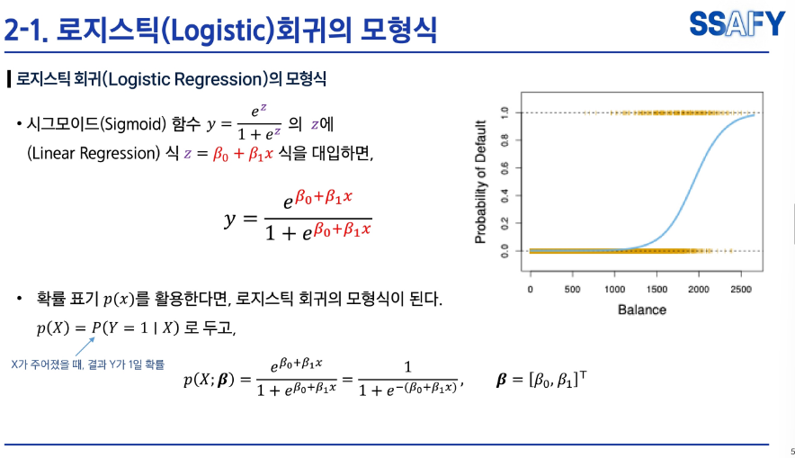

# AI 강의 1차

# AI 강의 2차

1. 단순선형회귀

2. 로지스틱 

3. Shallow network  (앝은 신경망)

- Shallow: 숨은층(히든 레이어)이 1개.
- Deep: 숨은층이 여러 개(보통 3개 이상을 deep이라 부름).

4. Deep network (다 신경망)

- 히든레이어 없이 직접연결? 
- 과적합(오버피팅) 위험↓, 가볍고 해석 가능하며 안정적입니다. 다만 표현력이 낮아 데이터가 복잡할수록 한계가 빨리 와요.

## (결과) 많아질수록, 유연한 곡선이 도출
5. 손실함수

* 이후 드랍 