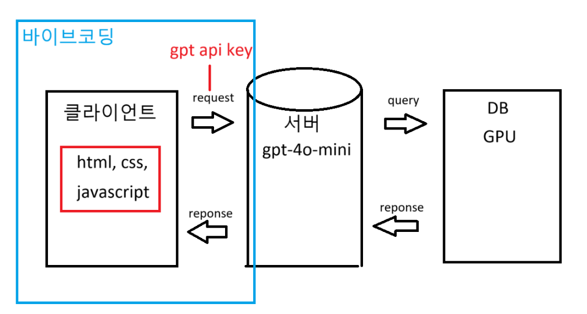

# 강의요약
### 7.16.(1차)
GUI : 그래픽 유저 인터페이스
TUI : 텍스트 (이말은 잘 안씁니다.)

CLI : Command Line Interface

interface : 대상을 제어하는 수단 ( ex) 리모컨) )

---

Window OS의 Interface
GUI : Windows Shell
CLI : cmd(명령프롬프트), Power Shell

Linux OS의 Interface
GUI : GNOME
CLI : bash

왜 굳이 bash를 쓸까??
bash가 편해서 ---> Tab키 자동완성

Git을 다룰때 Interface
GUI : Github Desktop, 소스트리
CLI : git bash

결론 : GUI, CLI 둘다 쓸수는 있어야하지만 우리는 CLI를 쓸겁니다.

GUI의 장점 : 그래프 같은 복잡한 분석 보기 편하다
CLI의 장점 : 빠르다(Commit 명령어 3~4초면 끝)

---

리눅스는 항상 HOME 디렉토리에서 시작 : ~
. : 현재 디렉토리
cd ~ : 홈 디렉토리
cd .. : 상위 디렉토리
cd - : 뒤로가기

touch : 파일생성
mkdir : 폴더생성
start : 파일 열기
rm : 파일 삭제
rm -rf : 폴더 삭제
cp : 복사

절대경로
~/Desktop/test/python/

상대경로(현재 티렉토리를 기준)
cd ./python
cd ../python2

---

python.org ---> python 설치 ---> 3.11.9
인터프리터

extension??
너 IDE 뭐써??
vscode는 IDE일까??
vscode는 텍스트 에디터 : 여기에 extension을 추가해서 마치 IDE처럼 쓴다.

IDE
Python : Pycharm, jupyter notebook
C : Visual Studio
Java : IntelliJ

node.js ---> 런타임
js 백엔드 프레임워크 ---> express.js 

---

Markdown : 로직 X 
README.md에 활용
: 내가 공부한내용, 프로젝트에 대한 간단한 설명(가독성, 편의성)

---
git init  : git 시작 (로컬 저장소 생성)
rm -rf .git : git 삭제(git 종료)

git add . : staging area에 변경사항 올리기
git status : staging area의 작업 파일 확인

git config --global user.email "이메일주소"
git config --global user.name "이름"
git config --global -l

git commit -m "메시지명" : repository에(staging area의 변경사항을)올리기
git log : repository 작업 파일 확인 (커밋 이력 확인)

---

참고자료 

git commit --amend : vim 에디터가 열린다

수정 후(커서 위치를 확인 후 과감하게 타이핑)

ecs -> :q -> 저장하지 않고 종료
ecs -> :q! -> 저장하지 않고 강제 종료
ecs -> :wq -> 저장하고 종료

### 7.17.(2차)
  git : 분산 버전 관리 시스템

git : 로컬저장소 // github : 원격저장소

git init : git 시작

git config --global user.name "이름"
git config --global user.email "이메일"

git add . : staging area에 올리기
git status : staging area의 작업 파일 확인

git commit -m "메시지명" : repository에 올리기
git log : 커밋 이력을 확인

git remote add origin url : 로컬 저장소와 원격저장소를 연결(origin은 별칭)
git remote -v : remote 목록 확인

git push origin +master : 가장 최근에 commit 되어있던 것을 강제로 push (origin:별칭, master:branch명, +:강제로 진행)

---

Q) clone과 pull의 차이점이 뭘까??
A) 새로운 환경에서 처음 다운로드 : clone

명령어 : git clone url

Q) clone을 받으면 remote를 할 필요가 있을까?
A) remote를 할 필요가 없다.

Q) clone과 pull의 차이?
A) 한번 clone을 받고 그 이후에는 pull로 진행

명령어 : git pull origin +master

---

자리 옮긴후 

1. git clonfig --global -l 확인
user.name, user.email 확인

1. 제어판 -> 사용자 계정 -> window 자격 증명 -> github, gitlab 삭제

commit 메시지 수정하기

명령어 : git commit --amend

vim에디터에서 수정하고
esc -> :q! : 저장하지 않고 강제 종료
esc -> :wq! : 강제 저장하고 종료

---
git revert : 특정 commit을 없었던 일로 만들기

a.txt 만들고 commit
b.txt 만들고 commit
c.txt 만들고 commit

git log -> 해시값 전체 복사(ctrl + shift + c), 붙여넣기(shift + insert)

명령어 :
git revert 해시값 : 이 특정 커밋을 없었던 일로 만든다.
vim 에디터 -> esc -> :wq

---

git reset : 특정 commit으로 되돌리기

git reflog : 이전 과거 commit 기록들을 모두 볼 수 있음

명령어 : git reset --hard HEAD@{번호}

---

staging area 있는 작업을 working directory로 옮기기
(git add 취소하기)

<git 2.23 버전 이전>

1. commit이 없는 경우
git rm --cached 파일명

2. 이전에 했던 commit이 있는경우(권장 방법)
git restore --staged 파일명

## 07.18.(금)
바이브 코딩을 함.
코파일럿을 활용하여 AI생성형 챗봇을 만듦.
코파일럿은 프로그래밍 경험이 없어도 코딩을 자동보완하는 EXTENSION임.

